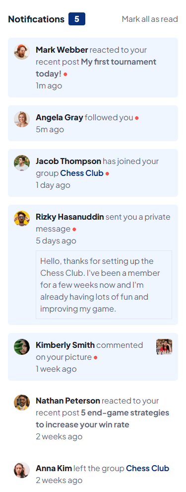
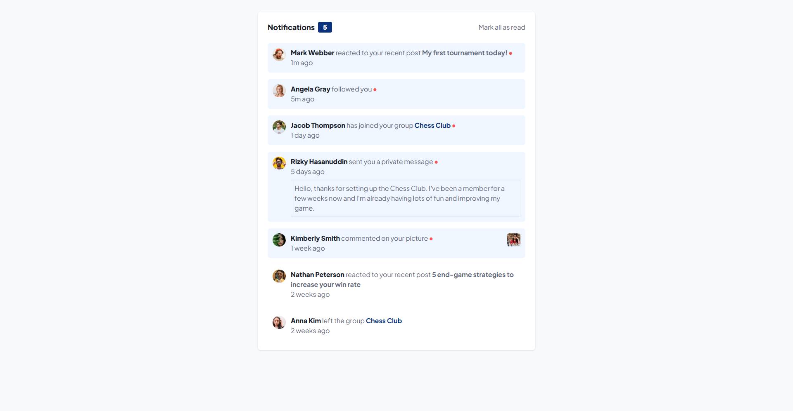

# Frontend Mentor - Notifications page solution

This is a solution to the [Notifications page challenge on Frontend Mentor](https://www.frontendmentor.io/challenges/notifications-page-DqK5QAmKbC). Frontend Mentor challenges help you improve your coding skills by building realistic projects.

## Table of contents

- [Frontend Mentor - Notifications page solution](#frontend-mentor---notifications-page-solution)
  - [Table of contents](#table-of-contents)
    - [Screenshot](#screenshot)
    - [Links](#links)
  - [My process](#my-process)
    - [Built with](#built-with)
    - [What I learned](#what-i-learned)
    - [Continued development](#continued-development)
    - [Useful resources](#useful-resources)
  - [Author](#author)

### Screenshot

### Links

- Solution URL: (https://github.com/molinax18/fm-notification-page)
- Live Site URL: (https://molinax18.github.io/fm-notification-page/)

## My process

### Built with

- Semantic HTML5 markup

- [TailwindCSS](https://tailwindcss.com/) - CSS framework
- Flexbox
- CSS Grid
- Mobile-first workflow

- [Vite](https://vite.dev/) - Frontend build
- [React](https://reactjs.org/) - JS library
- [TypeScript](https://www.typescriptlang.org/) - JS+ language

### What I learned

I focused on reinforcing knowledge I already had. I always try to improve it and add new things; even if it’s not perfect yet, it helps me better understand how things work.

### Continued development

I tried to structure the notification information using the appropriate TypeScript types and interfaces. I still have a lot to learn and understand about how to do it in the best way.

### Useful resources

Talwind, React, TypeScript documentation.

## Author

- Frontend Mentor - [@molinax18](https://www.frontendmentor.io/profile/molinax18)
